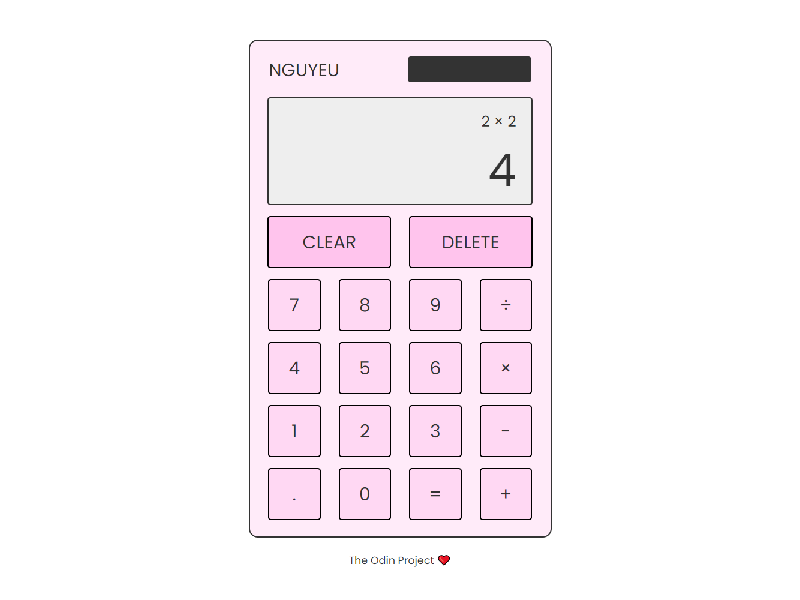

From [The Odin Project](https://www.theodinproject.com/).
# Calculator App
A simple calculator application you can use to add, subtract, multiply, and divide.

## Languages
* HTML
* CSS
* JavaScript

## Frameworks
* jQuery

 

## Things to Note
1. Values cannot be be divided by 0
2. Inputs must be equal or less than 8 numbers in length
3. Values less than 0.1 will be in scientific notation
4. Values > 0.1 and more than 8 numbers in length will be in scientific notation
